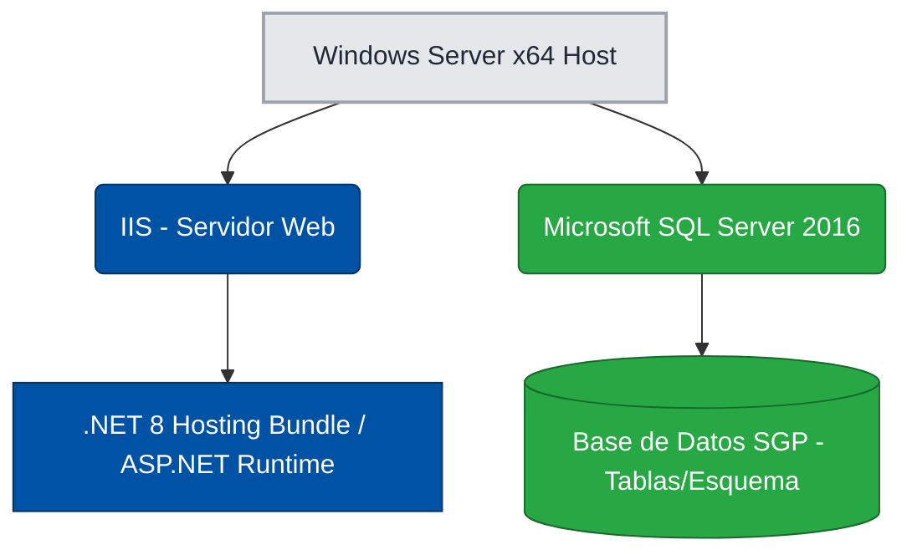

# INFORME TÉCNICO DE INGENIERÍA: DESPLIEGUE Y CONFIGURACIÓN DE SERVIDOR INSTITUCIONAL

> Estado actual: referencia historica conservada.  
> La referencia tecnica vigente para este tema se mantiene en `../Informes_Tecnicos/Informe_Tecnico_Servidor_SGP.md`.  
> Este archivo no debe usarse como fuente tecnica principal ni seguir divergiendo del informe vigente.

**Proyecto:** Sistema de Gestión de Parqueaderos PUCESA (SGP)
**Versión de Documento:** 1.0 (Entorno de Despliegue Configurado)
**Fecha de Actividad:** Lunes, 16 de Marzo de 2026
**Tecnología y Entorno:** Windows Server x64, IIS, .NET 8 Runtime, SQL Server 2016 SP2

---

## 1. Resumen Arquitectónico (Abstract)

El presente informe detalla el proceso de aprovisionamiento, configuración y validación operativa del servidor central institucional designado por la PUCESA. Este servidor, gobernado bajo entorno Windows Server de 64 bits, fue acondicionado arquitectónicamente para alojar el ecosistema web del SGP (Internet Information Services + .NET 8 Hosting Bundle) y servir como nodo centralizado de persistencia de datos relacionales mediante la integración nativa de SQL Server 2016 Engine.

## 2. Acceso y Aprovisionamiento del Entorno

Para garantizar la seguridad perimetral de la infraestructura de la universidad, el acceso a la máquina host se realizó a través de un túnel cifrado y protocolo de acceso remoto.

* **Método de Conexión:** Virtual Private Network (VPN Institucional) acoplada a protocolo RDP (Remote Desktop Protocol).
* **Vector de Acceso (IPv4):** resguardado por la institucion.
* **Credenciales de Dominio/Host:** resguardadas por la institucion.
* **Auditoría de Hardware Inicial:** Se certificó mediante diagnóstico interno que la arquitectura del procesador (x64) y la memoria RAM instalada cumplen con los requerimientos mínimos sostenibles exigidos por el motor SQL y el entorno de ejecución .NET.

## 3. Configuración de la Capa de Aplicación (Web Server & Runtime)

Para permitir el alojamiento de aplicaciones web (Plataforma SGP Web), se instalaron y habilitaron los siguientes componentes a nivel de sistema operativo:

### 3.1. Servidor Web (Reverse Proxy / Host)

* **Capa de Roles Server:** Instalación y habilitación del rol nativo Internet Information Services (`IIS`).
* **Verificación Operativa:** Solicitud HTTP de retorno exitosa (Status `200 OK`) lanzada internamente contra `http://localhost`, validando el puerto 80 del host.

### 3.2. Entorno de Ejecución (Runtime Environment)

Se evitó la instalación del SDK completo (reservado para entornos de desarrollo), instalando estrictamente los binarios de ejecución y enlace web.

* **Paquete Desplegado:** `.NET 8 ASP.NET Core Hosting Bundle`.
* **Resolución de Dependencias:** El paquete inyectó satisfactoriamente `.NET Runtime 8.0`, `ASP.NET Core Runtime 8.0` y el respectivo módulo de acople para `IIS`.
* **Validación de Entorno:** Ejecución en terminal (CLI) del comando `dotnet --info`, certificando el correcto mapeo de las variables de entorno para correr *assemblies* de plataforma web.

## 4. Configuración de la Capa de Persistencia (Base de Datos)

El servidor también asumirá el rol físico de base de datos, centralizando transacciones desde la web y las instancias de garita físicas.

### 4.1. Despliegue del Motor SQL

* **Motor (RDBMS):** `Microsoft SQL Server 2016` (Service Pack 2).
* **Roles y Features instaladas:** `SQL Engine` (Excluyendo servicios analíticos no requeridos para priorizar memoria).
* **Identificador de Instancia:** `MSSQLSERVER` (Instancia por defecto, puerto nativo TCP 1433).
* **Aprovisionamiento de Seguridad:** Autenticación mixta y definición de usuario administrador local del entorno.

### 4.2. Administración y Trazabilidad Local

* **Herramienta de Gestión Operativa:** Despliegue de `SQL Server Management Studio (SSMS)` de uso exclusivo en RDP para auditoría de tablas y gestión de permisos del pool de desarrolladores.
* **Certificación de Acceso:** Conexión exitosa vía `Windows Authentication`. Se habilitó formalmente la regla *Trust Server Certificate* eliminando el bloqueo SSL de capa de transporte.
* **Validación del Motor:** Retorno de versión exacto mediante ejecución T-SQL: `SELECT @@VERSION;`.

## 5. Arquitectura Final de Componentes y Despliegue de Esquema

Habiendo validado la conectividad total (Aplicación + Base de Datos), se procedió al despliegue físico del esquema relacional base del proyecto SGP mediante consola DML. Se ejecutó la importación del diccionario de tablas (Estructura) y el posterior Data Seeding (datos semilla necesarios para el arranque operativo web).

**Representación Topológica (Pila del Servidor Host):**

**Resumen Operativo Global:**
La instancia designada por la institucion se encuentra nominalmente configurada y certificada tanto para alojar aplicaciones compiladas ASP.NET, como para orquestar la gestión completa de persistencia multi-rol requerida para futuros despliegues en Staging / Producción.

---

**Firmas de Validación de Ingeniería:**

- Elaborado por: Referencia historica preservada
- Revisado por: _____________________________
- Aprobado por: _____________________________
