# INFORME TÉCNICO: INFRAESTRUCTURA DE HARDWARE — SECTOR COLISEO

## Sistema Institucional de Gestión de Parqueaderos Cato Parking

**Documento:** IT-INFRA-COL-001
**Versión:** 1.1
**Fecha de Emisión:** 11 de Abril de 2026
**Elaborado por:** Equipo de Desarrollo e Ingeniería SGP
**Dirigido a:** Dirección Administrativa / Comité de Implementación PUCESA
**Estado:** Informe técnico histórico con estabilización conceptual

---

## Propósito del Documento

El presente informe técnico tiene por objetivo documentar formalmente dos componentes críticos del despliegue histórico del sistema:

1. **El desglose financiero** de la inversión en hardware de grado industrial.
2. **El análisis técnico de la infraestructura en el Sector Coliseo**, detallando la configuración de doble pluma (Entrada y Salida) y el control de flujo vehicular.

Ambas secciones sirven como insumo para la toma de decisiones administrativa y la validación técnica del proyecto ante los organismos competentes de la PUCESA.

> **Nota de estabilización documental - 2026-07-17**
>
> - La denominación vigente del sistema es **Cato Parking**.
> - El controlador principal aprobado documentalmente es **ZKTeco InBIO 260**.
> - Cualquier referencia específica a controladoras alternativas, topologías exactas, sensores, relés o compatibilidades de SDK debe tratarse como información técnica pendiente de validación formal si no existe evidencia institucional adicional.

---

## 1. Análisis Económico y Técnico de la Infraestructura

### 1.1 Desglose de Inversión en Materiales y Suministros

Se ha proyectado un presupuesto detallado para la adquisición de hardware de grado industrial, garantizando la **compatibilidad nativa con el ecosistema ZKTeco** y el software SGP. Todos los precios están expresados en dólares estadounidenses (USD) e incluyen el coste unitario estimado de mercado para cada componente.

| Componente Técnico                                  | Cantidad | Costo Unitario (USD) |      Subtotal (USD) |  |
| :--------------------------------------------------- | :------: | -------------------: | ------------------: | :- |
| Lector UHF de largo alcance (UHF10 Pro)              |    2    |    $352.00 | $704.00 |                     |  |
| Lector QR / Tarjeta Mifare (Gestión de visitantes)  |    2    |    $165.00 | $330.00 |                     |  |
| Impresora Térmica 80mm (Emisión de tickets QR)     |    2    |    $242.00 | $484.00 |                     |  |
| Tags UHF Adhesivos para parabrisas (Stock inicial)   |  1,000  |    $1.32 | $1,320.00 |                     |  |
| Poste metálico de soporte para lectoras             |    2    |     $88.00 | $176.00 |                     |  |
| Kit de instalación (Cableado, tubería, conectores) |    1    |    $330.00 | $330.00 |                     |  |
| Caja Metálica (Protección de controladora)         |    1    |      $50.00 | $50.00 |                     |  |
| Cajetín de pared                                    |    2    |        $3.00 | $6.00 |                     |  |
| **TOTAL INVERSIÓN MATERIALES**                |          |                      | **$3,400.00** |  |

---

### 2 Análisis de Infraestructura Física: Sector Coliseo

A diferencia de otros puntos de acceso, el **Sector Coliseo** implementa un cambio de paradigma mediante un **sistema de doble carril segregado**. Esta configuración utiliza dos plumas electromecánicas independientes (una asignada exclusivamente para la entrada y otra para la salida), lo que permite un flujo vehicular bidireccional simultáneo de alta eficiencia.

#### 2.1 Subsistema de Identificación — Lectores UHF (x2)

Se instalan dos unidades de lectura UHF de largo alcance, una para cada carril:

| Componente                 | Descripción Funcional                                                                                                                                                                                          |
| :------------------------- | :-------------------------------------------------------------------------------------------------------------------------------------------------------------------------------------------------------------- |
| **Antena UHF (x2)**  | Lectores ZKTeco (modelo UHF10 Pro) montados en postes metálicos a ambos lados del carril de acceso. Identifican el tag RFID adhesivo del parabrisas sin requerir que el conductor se detenga (*hands-free*). |
| **Rango de Lectura** | Hasta 6–10 metros en condiciones estándar, garantizando la captura del tag antes de que el vehículo alcance la pluma.                                                                                        |
| **Protocolo**        | EPC Gen 2 / ISO 18000-6C. Comunicación con el controlador vía Wiegand o TCP/IP.                                                                                                                               |

Cada barrera (Entrada y Salida) posee su propio conjunto de **sensores de lazo de inducción magnética** para garantizar la seguridad y la correcta ejecución del ciclo de apertura/cierre.

| Sensor                                         |      Posición      | Aplicación (Entrada)                                                 | Aplicación (Salida)                                                            |
| :--------------------------------------------- | :------------------: | :-------------------------------------------------------------------- | :------------------------------------------------------------------------------ |
| **Sensor de Presencia**                  |  Antes de la pluma  | Detecta vehículo para iniciar lectura UHF o emisión de ticket.      | Detecta vehículo para autorizar salida mediante validación de pago o Tag UHF. |
| **Sensor de Brazo (Anti-aplastamiento)** |    Bajo la pluma    | Evita el descenso de la pluma de entrada mientras el vehículo cruza. | Evita el descenso de la pluma de salida mientras el vehículo cruza.            |
| **Sensor de Cierre**                     | Después de la pluma | Envía señal de cierre seguro a la pluma de entrada.                 | Envía señal de cierre seguro a la pluma de salida.                            |

#### 2.3 Subsistema de Control — Caja de Hardware

La **Caja de Hardware** es el núcleo de operaciones del punto de acceso. Físicamente, es un gabinete metálico protegido que alberga los siguientes componentes:

- **Controladora de Acceso ZKTeco** (ej. modelo C3-200 o InBIO): Procesador lógico del sistema. Recibe señales de los loops y los lectores UHF, ejecuta las reglas de acceso y envía comandos de apertura/cierre a la pluma.
- **Fuente de Poder Conmutada (12V DC):** Alimenta todos los componentes de baja tensión (lectores, loops, controladora).
- **Módulo de Relés:** Interfaz entre la señal lógica de la controladora y el actuador eléctrico de la pluma.
- **Interruptores Físicos / Pulsadores:** Permiten la **apertura y cierre manual** de la barrera, indispensables para situaciones de mantenimiento, emergencia o fallo del sistema central.

#### 2.4 Diagrama Funcional: Flujo Dual Simultáneo

```mermaid
graph TD
    subgraph "CARRIL DE ENTRADA"
        E1["Vehículo Se Aproxima"] --> E2["Sensor Presencia Entrada"]
        E2 --> E3{"¿Tag UHF Válido?"}
        E3 -->|"SÍ"| E4["Pluma Entrada SUBE"]
        E3 -->|"NO"| E5["Emisión Ticket QR"]
        E5 --> E6["Conductor Escanea"]
        E6 --> E4
        E4 --> E7["Sensor Brazo Anti-aplastamiento"]
        E7 --> E8["Vehículo Despeja Área"]
        E8 --> E9["Sensor Cierre Entrada"]
        E9 --> E10["Pluma Entrada BAJA"]
    end

    subgraph "CARRIL DE SALIDA"
        S1["Vehículo Se Aproxima"] --> S2["Sensor Presencia Salida"]
        S2 --> S3{"¿Pago/Tag Validado?"}
        S3 -->|"SÍ"| S4["Pluma Salida SUBE"]
        S3 -->|"NO"| S5["Pago en Caja/App"]
        S5 --> S4
        S4 --> S6["Sensor Brazo Anti-aplastamiento"]
        S6 --> S7["Vehículo Despeja Área"]
        S7 --> S8["Sensor Cierre Salida"]
        S8 --> S9["Pluma Salida BAJA"]
    end
```

---

### 3 Evidencia Simulada: Sector Coliseo

La siguiente documentación visual confirma la disposición física de los puntos de acceso en el Sector Coliseo. La inspección técnica valida que las plumas actuales son aptas para la integración con el hardware de control SGP, por lo que no se requiere inversión adicional en barreras físicas.

# Simulación Entrada Garaje

::: carousel

# Simulación Salida Garaje

<!-- slide -->

:::

*Descripción: Detalle técnico de la infraestructura en el punto de entrada y salida del Sector Coliseo. Se observa la ubicación prevista para las antenas UHF, los sensores de lazo y la integración con las plumas existentes.*

---

## 4. Conclusiones y Próximos Pasos

La infraestructura proyectada representa una solución tecnológica **coherente, escalable y segura** para el control vehicular de la PUCESA. La combinación de:

- **Lectores UHF de largo alcance** → eliminan cuellos de botella en el acceso.
- **Lazos de inducción magnética** → garantizan la seguridad física de los vehículos y conductores.
- **Controladora ZKTeco centralizada** → permite administración remota, registros de auditoría y escalabilidad futura.

*Documento elaborado por el **Equipo de Desarrollo e Ingeniería — Proyecto histórico SGP PUCESA / Cato Parking**.*
*Para consultas técnicas, contactar al equipo de ingeniería del proyecto.*
