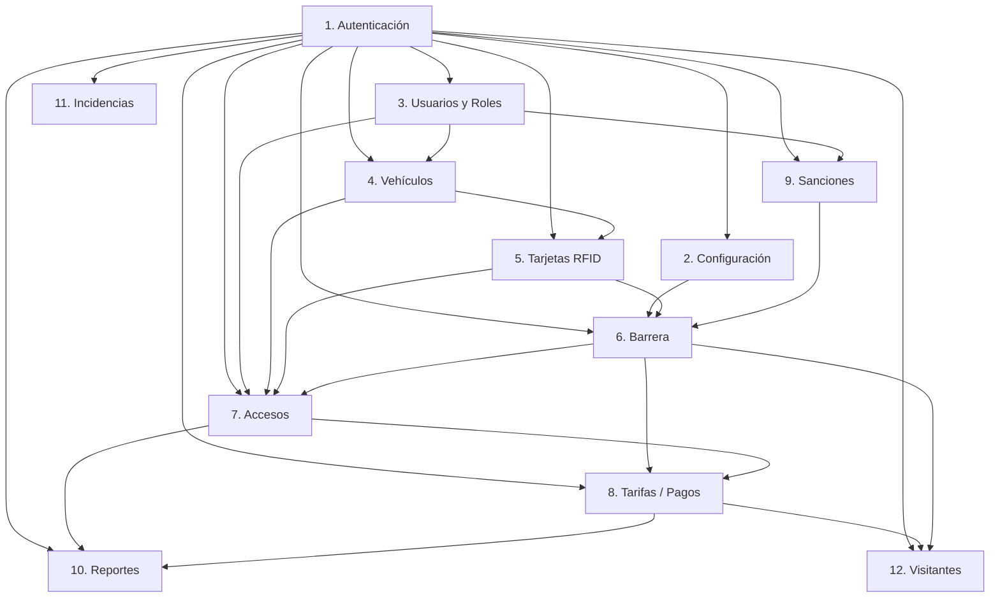

# 🚗 Sistema de Gestión Multiuso de Parqueadero PUCESA

Sistema centralizado para la administración inteligente de espacios de estacionamiento, diseñado para optimizar el control de acceso vehicular mediante hardware especializado y gestión automatizada, implementado para la Pontificia Universidad Católica del Ecuador Sede Ambato (PUCESA).

---

## 📋 Descripción del Proyecto

Este sistema permite gestionar de forma integral y automática el ciclo completo de operación de un parqueadero universitario, integrando hardware de control de acceso con software de gestión en tiempo real.

El sistema controla una **barrera vehicular automatizada** mediante lectores RFID que validan el acceso de vehículos registrados, proporcionando un registro detallado de entradas y salidas, y facilitando la administración de usuarios, vehículos y tarifas.

### Características Principales

* **Control de Acceso Automatizado:** Validación física mediante lectores RFID (TAG) que activan automáticamente la barrera vehicular
* **Monitoreo en Tiempo Real:** Visualización de eventos de acceso, estado de lectores y movimientos del parqueadero
* **Gestión de Tarjetas RFID:** Sistema completo de registro, activación, desactivación y auditoría de credenciales
* **Registro de Movimientos:** Historial completo de todas las entradas y salidas con timestamps precisos
* **Base de Datos Centralizada:** Almacenamiento estructurado de usuarios, vehículos, accesos, pagos y sanciones
* **Interfaz Gráfica Intuitiva:** Aplicación de escritorio con Windows Forms para operación y configuración

---

## 🎯 Objetivos del Sistema

1. **Automatizar el control de acceso vehicular** en los parqueaderos de PUCESA
2. **Eliminar procesos manuales** de apertura y cierre de barreras
3. **Registrar y auditar** todos los movimientos vehiculares con precisión temporal
4. **Gestionar perfiles diferenciados** (Estudiantes, Docentes, Administrativos, Visitantes)
5. **Integrar hardware especializado** (ZKTeco InBIO 206) con software de gestión
6. **Facilitar la facturación y control de pagos** según tarifas configurables
7. **Aplicar sanciones automáticas** por incumplimiento de normas
8. **Proporcionar reportes administrativos** para toma de decisiones

---

## ✅ Funcionalidades Actuales

### ✔️ Implementado y Funcional

* **Conexión con Panel de Control ZKTeco InBIO 206**
  - Comunicación TCP/IP estable con el controlador de acceso
  - Soporte para 2 puertas (entrada y salida)
  - Heartbeat y reconexión automática
  
* **Lectura de Tarjetas RFID en Tiempo Real**
  - Detección automática de TAGs al pasar por los lectores
  - Parsing de eventos del SDK (E0, E20, E27)
  - Identificación de lector (Reader 1 entrada, Reader 4 salida)

* **Autorización de Acceso**
  - Validación contra base de datos local (JSON)
  - Apertura automática de barrera para TAGs autorizados
  - Bloqueo de acceso para TAGs no registrados o deshabilitados

* **Control de Barrera Vehicular**
  - Comando de subir brazo (LOCK 1)
  - Manejo de conflictos LOCK 1/LOCK 2
  - Cancelación automática de señales en conflicto
  - Temporización configurable de pulsos

* **Gestión de Tarjetas**
  - Alta de nuevas tarjetas con datos de usuario
  - Modificación de información de tarjetas
  - Habilitación / Deshabilitación de tarjetas
  - Eliminación de tarjetas del sistema
  - Modo de detección para registrar TAGs nuevas

* **Registro de Eventos**
  - Tabla visual de todos los accesos (entrada/salida)
  - Timestamp de cada evento
  - Identificación de usuario y número de tarjeta
  - Estado de autorización (aprobado/denegado)

* **Protección Anti-Rebote**
  - Filtrado de lecturas duplicadas (ventana de 5 segundos)
  - Prevención de activaciones múltiples del relay

* **Interfaz de Usuario**
  - Pestaña de Configuración de Hardware
  - Pestaña de Control de Acceso (visualización de eventos)
  - Pestaña de Gestión de Tarjetas
  - Estadísticas en tiempo real (total, habilitadas, deshabilitadas)
  - Logs de sistema con codificación por colores

### 🚧 En Desarrollo / Planificado

* **Integración con SQL Server**
  - Migración de almacenamiento JSON a base de datos relacional
  - Entity Framework Core para operaciones CRUD
  - Stored procedures para lógica de negocio

* **Sistema de Tarifas**
  - Cálculo automático de cobros por hora/fracción
  - Tarifas diferenciadas por tipo de usuario
  - Descuentos por discapacidad o espacios mixtos

* **Gestión de Visitantes**
  - Registro temporal de vehículos no registrados
  - Tickets con código de barras/QR para salida

* **Sistema de Sanciones**
  - Bloqueo automático por incumplimiento de horarios
  - Gestión de multas y pagos pendientes
  - Notificaciones por correo electrónico

* **Reportes Administrativos**
  - Ocupación en tiempo real y histórica
  - Exportación a PDF/Excel
  - Dashboard con indicadores clave

* **Autenticación Institucional**
  - Login con credenciales Microsoft (SSO)
  - Roles y permisos diferenciados

---

## 🏗️ Arquitectura del Proyecto

### Estructura de Archivos

```
📦 Sistema-de-Gestión-Multiuso-de-Parqueadero
├── 📄 InterfazParqueadero.sln          # Solución de Visual Studio
├── 📄 InterfazParqueadero.csproj       # Archivo de proyecto .NET
├── 📄 Program.cs                        # Punto de entrada de la aplicación
├── 📄 Form1.cs                          # Formulario principal (UI y lógica)
├── 📄 Form1.Designer.cs                 # Diseñador de formulario (auto-generado)
├── 📄 Form1.resx                        # Recursos del formulario
├── 📄 ZKTecoManager.cs                  # Gestor de comunicación con hardware
├── 📄 TarjetasDB.cs                     # Gestor de base de datos de tarjetas
├── 📄 tarjetas_autorizadas.json        # Almacenamiento local de TAGs (temporal)
│
├── 📂 Documentos/
│   ├── 📄 COMANDOS-GIT.md              # Guía de comandos Git
│   ├── 📄 CONVENCIONES.md              # Estándares de commits y ramas
│   ├── 📄 INSTALACION-GIT.md           # Instrucciones de configuración Git
│   ├── 📄 SOLICITUDES.md               # Gestión de requerimientos
│   ├── 📄 Task_List.md                 # Lista de tareas y progreso
│   │
│   ├── 📂 database/
│   │   ├── 📄 dbo.sql                  # Script DDL de base de datos completa
│   │   ├── 📄 dbo.bak                  # Backup de base de datos
│   │   └── 📄 datos_prueba.sql         # Datos de prueba
│   │
│   └── 📂 parqueadero-docs/
│       ├── 📄 Acta Semanal_Semana_1.md
│       └── 📄 plantilla_formato_ieee830-parqueadero.md
│
├── 📂 Properties/
│   ├── 📄 Resources.Designer.cs
│   └── 📄 Resources.resx
│
├── 📂 Resources/                        # Imágenes y recursos visuales
│
└── 📂 obj/                              # Archivos de compilación (auto-generado)
```

### Componentes Clave

#### 1. **Form1.cs** - Interfaz Principal
- Inicialización de componentes (ZKTecoManager, TarjetasDB)
- Manejo de eventos de interfaz de usuario
- Procesamiento de eventos de hardware en tiempo real
- Actualización de tablas de visualización
- Control de estado de conexión

#### 2. **ZKTecoManager.cs** - Capa de Hardware
- Importación de funciones nativas del SDK (`plcommpro.dll`)
- Gestión de conexión TCP/IP con el panel InBIO 206
- Envío de comandos de control (abrir barrera, cancelar señales)
- Lectura de eventos en tiempo real (`GetRTLog`)
- Parsing de eventos RFID
- Generación de logs de diagnóstico

#### 3. **TarjetasDB.cs** - Capa de Datos
- Operaciones CRUD sobre tarjetas RFID
- Serialización/deserialización JSON
- Validación de autorización de acceso
- Actualización de estados (habilitada/deshabilitada)

#### 4. **Modelo de Datos - TarjetaRFID**
```csharp
public class TarjetaRFID
{
    public string Numero { get; set; }            // Número del TAG RFID
    public string NombreUsuario { get; set; }      // Propietario
    public string Observaciones { get; set; }      // Notas (placa, tipo vehículo)
    public DateTime FechaRegistro { get; set; }    // Fecha de alta
    public bool Habilitada { get; set; }           // Estado activo/inactivo
}
```

### Flujo de Operación

```
┌──────────────┐
│   Usuario    │
│  con TAG     │
└──────┬───────┘
       │
       ▼
┌──────────────────────┐
│  Sensor de Piso      │  ◄─── Detecta metal debajo del vehículo
│  (activa lectura)    │
└──────┬───────────────┘
       │
       ▼
┌──────────────────────┐
│  Lector RFID         │  ◄─── Reader 1 (entrada) o Reader 4 (salida)
│  (lee TAG)           │
└──────┬───────────────┘
       │
       ▼
┌──────────────────────┐
│  Panel InBIO 206     │  ◄─── Genera evento E0/E20/E27
│  (procesa lectura)   │
└──────┬───────────────┘
       │
       ▼ (TCP/IP)
┌──────────────────────┐
│  ZKTecoManager       │  ◄─── GetRTLog() obtiene evento
│  (SDK C#)            │
└──────┬───────────────┘
       │
       ▼
┌──────────────────────┐
│  Form1               │  ◄─── Evento OnEventoHardware
│  (lógica de negocio) │
└──────┬───────────────┘
       │
       ▼
┌──────────────────────┐
│  TarjetasDB          │  ◄─── Valida si TAG está autorizado
│  (consulta JSON/SQL) │
└──────┬───────────────┘
       │
   ┌───┴────┐
   ▼        ▼
┌──────┐  ┌──────┐
│ ✅    │  │ ❌   │
│ SI    │  │ NO   │
└──┬───┘  └──┬───┘
   │         │
   ▼         ▼
┌──────────────────────┐
│  ControlDevice()     │  ◄─── Comando LOCK 1 = subir brazo
│  (activa relay)      │       o no enviar comando
└──────┬───────────────┘
       │
       ▼
┌──────────────────────┐
│  Barrera Sube        │  ◄─── Motor físico recibe señal
│  (acceso concedido)  │
└──────────────────────┘
       │
       ▼
┌──────────────────────┐
│  Registro de Acceso  │  ◄─── Se guarda en tabla RegistrosAcceso
│  (auditoría)         │
└──────────────────────┘
```

---

## 💻 Tecnologías Utilizadas

### Lenguajes y Frameworks

| Componente | Tecnología | Versión |
|:-----------|:-----------|:--------|
| **Framework** | .NET | 8.0 (LTS) |
| **Lenguaje** | C# | 12.0 |
| **UI Framework** | Windows Forms | 8.0 |
| **Arquitectura** | x86 (32-bit) | - |

### Herramientas de Desarrollo

| Herramienta | Versión |
|:------------|:--------|
| **Visual Studio Professional 2022** | 17.14.27 (Febrero 2026) |
| **Visual Studio Code** | Latest |
| **SQL Server Management Studio** | 22 |
| **Microsoft SQL Server Express** | 17.0.1000.7 |
| **EF Core Power Tools** | Latest |
| **Git** | 2.x+ |

### Hardware y SDKs

| Componente | Descripción |
|:-----------|:------------|
| **ZKTeco InBIO 206** | Panel de control de acceso con 2 puertas |
| **Lectores RFID** | Reader 1 (WD1, WD0) y Reader 4 (GLED, WD1) |
| **SDK Pull Communication** | plcommpro.dll (ZKTeco oficial) |
| **Protocolo** | TCP/IP (puerto 4370) |

### Base de Datos (Planificada)

| Componente | Descripción |
|:-----------|:------------|
| **Motor** | Microsoft SQL Server Express |
| **ORM** | Entity Framework Core 8.0+ |
| **Almacenamiento Actual** | JSON (temporal, migrará a SQL) |

### Librerías y Dependencias

- **System.IO.Ports** - Comunicación serial (futuro)
- **System.Text.Json** - Serialización JSON
- **System.Runtime.InteropServices** - P/Invoke para DLL nativa
- **System.Windows.Forms** - Interfaz gráfica

---

## 🔧 Instalación y Configuración

### Requisitos Previos

- **Sistema Operativo:** Windows 10/11 (64-bit)
- **RAM:** Mínimo 4 GB
- **.NET 8.0 SDK:** [Descargar aquí](https://dotnet.microsoft.com/download/dotnet/8.0)
- **Visual Studio 2022** o **Visual Studio Code**
- **SQL Server Express** (para base de datos futura)
- **Git:** Para clonar el repositorio

### Paso 1: Clonar el Repositorio

```bash
git clone https://github.com/JonaAcurio/Sistema-de-Gesti-n-Multiuso-de-Parqueadero.git
cd Sistema-de-Gesti-n-Multiuso-de-Parqueadero
```

### Paso 2: Configurar el SDK de ZKTeco

1. Asegurarse de que `plcommpro.dll` esté en el directorio raíz del proyecto o en `C:\Windows\System32\`
2. La DLL debe ser de 32-bit (coincide con `<PlatformTarget>x86</PlatformTarget>`)

**Nota:** El SDK se incluye con el instalador del panel InBIO o puede solicitarse a ZKTeco.

### Paso 3: Restaurar Dependencias y Compilar

#### Con Visual Studio 2022:
1. Abrir `InterfazParqueadero.sln`
2. Click derecho en la solución → **Restaurar paquetes NuGet**
3. Compilar: **Build → Build Solution** (F6)
4. Ejecutar: **Debug → Start Debugging** (F5)

#### Con CLI de .NET:
```bash
dotnet restore
dotnet build
dotnet run
```

### Paso 4: Configurar Conexión con el Hardware

Al abrir la aplicación:

1. Ir a la pestaña **⚙️ Configuración**
2. Configurar los parámetros de conexión:
   - **IP:** `192.168.1.201` (dirección del panel InBIO)
   - **Puerto:** `4370` (puerto TCP predeterminado)
   - **Timeout:** `4000` ms
3. Click en **CONECTAR**
4. Verificar el estado de conexión en el log

**Configuración de Red del Panel:**
- Asegurarse de que el panel InBIO esté en la misma red local
- Verificar que no haya firewalls bloqueando el puerto 4370

### Paso 5: Registrar Tarjetas de Prueba

1. Ir a la pestaña **🎫 Gestión de Tarjetas**
2. Click en **🔍 DETECTAR** (modo escucha)
3. Pasar un TAG RFID por el lector
4. Completar los campos:
   - **Nº Tarjeta:** (auto-detectado)
   - **Nombre Usuario:** Nombre del propietario
   - **Observaciones:** Placa del vehículo, tipo, etc.
5. Click en **➕ AGREGAR**

### Paso 6: Probar el Sistema

1. Ir a la pestaña **🔖 Control de Acceso (RFID)**
2. Pasar un TAG registrado por el Reader 1 (entrada)
3. Verificar que:
   - Aparece el evento en la tabla
   - El estado muestra "AUTORIZADO"
   - La barrera sube automáticamente
   - El log muestra "✓ TAG AUTORIZADO - Comando Subir enviado"

---

## 🗄️ Configuración de Base de Datos

### Estado Actual

El sistema actualmente utiliza **almacenamiento JSON local** para las tarjetas autorizadas:
- Archivo: `tarjetas_autorizadas.json`
- Estructura: Array de objetos TarjetaRFID
- Persistencia automática en cada operación CRUD

### Migración a SQL Server (Próximamente)

#### Estructura de Base de Datos

La base de datos `dbo` contiene las siguientes tablas principales:

**📊 Entidades Principales:**

1. **Roles** - Tipos de usuario (Estudiante, Docente, Administrativo, Guardia, Financiero)
2. **Usuarios** - Datos personales y credenciales
3. **Vehiculos** - Información de vehículos registrados
4. **Tags** - Inventario de tarjetas RFID físicas
5. **Garajes** - Parqueaderos con capacidad y ocupación
6. **Tarifas** - Precios por tipo de usuario y franja horaria

**📋 Operaciones:**

7. **Accesos** - Registro de entradas/salidas (historial completo)
8. **Asignacion_Tags** - Relación TAG ↔ Vehículo
9. **Tickets** - Tickets de visitantes con cálculo de tarifa
10. **Pagos** - Transacciones y métodos de pago
11. **Sanciones** - Multas por incumplimiento

**🔧 Configuración:**

12. **Periodo_Inscripcion** - Ventanas de registro semestral
13. **Horarios_Garaje** - Horarios de operación por parqueadero
14. **Franja** - Franjas horarias para tarifas diferenciadas
15. **Incidencias** - Reporte de fallas técnicas

#### Instalación de la Base de Datos

```bash
# 1. Abrir SQL Server Management Studio
# 2. Conectar a la instancia local:
#    Server: localhost\SQLEXPRESS
#    Authentication: Windows Authentication

# 3. Ejecutar el script DDL:
cd Documentos/database
# Abrir dbo.sql y ejecutar en SSMS
```

#### Modelo Relacional Simplificado

```
Usuarios ──┬── Vehiculos ──┬── Asignacion_Tags ──── Tags
           │               │
           │               └── Accesos ──── Garajes
           │
           ├── Sanciones ── Tipo_Sanciones
           │
           ├── Pagos ────── Metodos_Pago
           │
           └── Inscripciones ── Periodo_Inscripcion
```

#### Conexión desde C# (Futuro)

**ConnectionString esperado:**

```csharp
"Server=localhost\\SQLEXPRESS;Database=dbo;Trusted_Connection=True;TrustServerCertificate=True;"
```

**Entity Framework Core:**

```bash
# Instalar paquetes NuGet
dotnet add package Microsoft.EntityFrameworkCore.SqlServer
dotnet add package Microsoft.EntityFrameworkCore.Tools

# Generar DbContext desde base de datos existente
dotnet ef dbcontext scaffold "Server=localhost\SQLEXPRESS;Database=dbo;Trusted_Connection=True;TrustServerCertificate=True;" Microsoft.EntityFrameworkCore.SqlServer -o Models
```

---

## 🚀 Cómo Ejecutar el Proyecto

### Ejecución en Modo Debug

```bash
# Terminal / CMD
cd Sistema-de-Gesti-n-Multiuso-de-Parqueadero
dotnet run
```

O presionar **F5** en Visual Studio.

### Ejecución en Modo Release

```bash
dotnet build --configuration Release
cd bin/Release/net8.0-windows
InterfazParqueadero.exe
```

### Workflow Típico de Operación

1. **Iniciar Aplicación**
   - Abrir InterfazParqueadero.exe
   
2. **Conectar al Hardware**
   - Pestaña Configuración → CONECTAR
   - Verificar log: "✓ ¡CONEXIÓN EXITOSA!"

3. **Monitorear Accesos en Tiempo Real**
   - Pestaña Control de Acceso (RFID)
   - Observar eventos en la tabla al pasar TAGs

4. **Gestionar Tarjetas**
   - Pestaña Gestión de Tarjetas
   - Agregar, editar, habilitar/deshabilitar

5. **Cerrar Aplicación**
   - La conexión se cierra automáticamente
   - Los datos se guardan en tarjetas_autorizadas.json

---

## Dependencias entre Módulos

El siguiente diagrama muestra la relación y dependencias entre los módulos del sistema de gestión de parqueaderos.



---

## 📊 Estado de Desarrollo

### Versión Actual: 2.0 (Funcional)

**Último Backup:** 2026-02-27

### ✅ Completado (100%)

- [x] Comunicación estable con InBIO 206
- [x] Lectura de eventos RFID en tiempo real
- [x] Autorización de acceso con base de datos local
- [x] Control automático de barrera
- [x] Gestión completa de tarjetas (CRUD)
- [x] Registro visual de accesos
- [x] Sistema anti-rebote
- [x] Manejo de eventos E0, E20, E27
- [x] Resolución de conflicto LOCK1/LOCK2
- [x] Interfaz gráfica completa con 3 pestañas

### 🚧 En Progreso (40%)

- [ ] Migración de JSON a SQL Server (base de datos diseñada)
- [ ] Integración con Entity Framework Core
- [ ] Sistema de tarifas y cobros
- [ ] Gestión de visitantes
- [ ] Autenticación de usuarios (login)

### 📅 Planificado (0%)

- [ ] Sistema de sanciones automáticas
- [ ] Reportes administrativos (PDF/Excel)
- [ ] Dashboard con métricas en tiempo real
- [ ] Notificaciones por correo electrónico
- [ ] Sincronización con Active Directory PUCESA
- [ ] Aplicación móvil para gestión remota
- [ ] API REST para integración con otros sistemas

---

## 🔮 Mejoras Futuras

### Corto Plazo (3-6 meses)

1. **Finalizar migración a SQL Server**
   - Implementar Entity Framework Core
   - Crear repositorios para cada entidad
   - Implementar stored procedures para lógica compleja

2. **Sistema de Usuarios y Roles**
   - Login con credenciales institucionales
   - Permisos diferenciados (Guardia, Administrativo, Financiero)
   - SSO con Microsoft 365 PUCESA

3. **Gestión de Visitantes**
   - Generación de tickets temporales
   - Cálculo automático de tarifa por hora
   - Impresión de comprobantes de pago

### Mediano Plazo (6-12 meses)

4. **Sistema de Reportes**
   - Ocupación en tiempo real por parqueadero
   - Historial de accesos con filtros
   - Exportación a Excel/PDF
   - Gráficos de uso por franjas horarias

5. **Portal Web Administrativo**
   - Interfaz web para consultas remotas
   - Dashboard con indicadores clave
   - Gestión de tarifas y periodos de inscripción

6. **Integración Financiera**
   - Conexión con sistema de contabilidad PUCESA
   - Emisión automática de facturas electrónicas
   - Pasarela de pagos en línea

---

## 👥 Autores y Contribuidores

### Equipo de Desarrollo

| Nombre | Rol | GitHub |
|:-------|:----|:-------|
| **Dennys Coronel** | Director | - |
| **Jonathan Acurio** | Project Management | [@JonaAcurio](https://github.com/JonaAcurio) |
| **Carlos Parreño** | Project Management | - |
| **Carlos Ortega** | Developer | - |
| **Alberto Falconí** | Developer | - |
| **Jeremy Jácome** | Developer | - |
| **Sebastián Sanmartín** | Developer | - |

### Institución

**Pontificia Universidad Católica del Ecuador Sede Ambato (PUCESA)**  
Facultad de Hábitat, Infraestructura y Creatividad

---

## 📄 Licencia

Este proyecto es de **carácter estrictamente académico** para la comunidad universitaria de PUCESA.

**Restricciones:**
- No se permite el uso comercial sin autorización expresa
- El código fuente es propiedad intelectual de la PUCESA
- Cualquier derivación o fork debe citar apropiadamente la fuente

**Uso Educativo:**
Se permite el uso del código con fines educativos y de investigación, siempre que se cite adecuadamente:

```
Acurio, J., Coronel, D., Falconí, Jácome, J., A., Ortega, C., Parreño, C., & Sanmartín, S. (2026).
Sistema de Gestión Multiuso de Parqueadero PUCESA.
Pontificia Universidad Católica del Ecuador Sede Ambato.
```

---

## 📞 Contacto y Soporte

### Reporte de Bugs

Para reportar errores o solicitar nuevas funcionalidades:

1. Abrir un **Issue** en GitHub con la plantilla correspondiente
2. Incluir:
   - Descripción detallada del problema
   - Pasos para reproducir
   - Capturas de pantalla (si aplica)
   - Logs del sistema

### Contribuciones

Las contribuciones son bienvenidas siguiendo las convenciones del proyecto:

1. Fork del repositorio
2. Crear rama con nomenclatura estándar: `feat/nueva-funcionalidad`
3. Commit con mensajes descriptivos: `feat: agregar validación de placas`
4. Pull Request con descripción completa de cambios

**Ver:** [Documentos/CONVENCIONES.md](Documentos/CONVENCIONES.md) para estándares de código

---

## 🙏 Agradecimientos

- **ZKTeco** por el SDK y soporte técnico del panel InBIO 206
- **PUCESA** por el apoyo institucional y recursos para el desarrollo
- **Comunidad de .NET** por documentación y tutoriales
- Todos los usuarios beta que probaron el sistema y reportaron mejoras

---

## 📚 Documentación Adicional

- [Task_List.md](Documentos/Task_List.md) - Lista de tareas y requisitos funcionales
- [COMANDOS-GIT.md](Documentos/COMANDOS-GIT.md) - Guía básica de Git
- [Resumen_para_la_IA.md](Resumen_para_la_IA.md) - Especificaciones técnicas detalladas
- [README_V2.md](README_V2.md) - Notas de la versión 2.0 funcional

---

<div align="center">

**Desarrollado con ❤️ para la comunidad PUCESA**


</div>